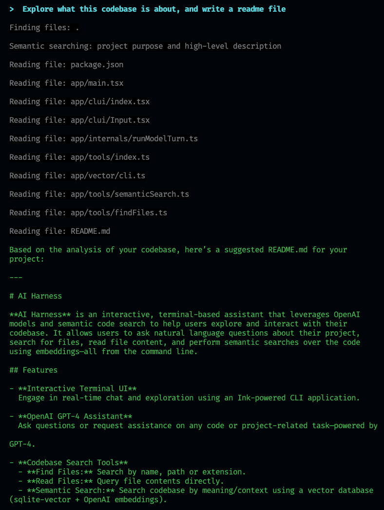

# AI Harness

**AI Harness** is an interactive, terminal-based assistant that leverages OpenAI models and semantic code search to help users explore and interact with their codebase. It allows users to ask natural language questions about their project, search for files, read file content, and perform semantic searches over the code using embeddings—all from the command line.

> [!NOTE]
> README.md was generated by `ai-harness` by self assesment of the codebase.



## Features

- **Interactive Terminal UI**  
  Engage in real-time chat and exploration using an Ink-powered CLI application.

- **OpenAI GPT-4 Assistant**  
  Ask questions or request assistance on any code or project-related task—powered by GPT-4.

- **Codebase Search Tools**
  - **Find Files:** Search by name, path or extension.
  - **Read Files:** Query file contents directly.
  - **Semantic Search:** Search codebase by meaning/context using a vector database (sqlite-vector + OpenAI embeddings).

- **Persistent Transcripts**  
  Each session's Q&A is automatically saved as a JSON transcript for review.

- **Customizable and Extensible**  
  Easily extend with additional tools and integrations.

## How It Works

- The app uses OpenAI's API for chat completions and embeddings (requires an `OPEN_AI_API_KEY`).
- Codebase files are indexed into a local vector database for semantic search.
- Implements several tools (find files, read file, semantic search, write, etc.) that the assistant can call autonomously.
- All running inside a modern, type-safe TypeScript/Bun/React codebase.

## Getting Started

### Prerequisites

- [Bun](https://bun.sh/)
- Node-compatible terminal
- OpenAI API key

### Installation

1. **Clone the repository:**

┌────────────────────────────┐
│ git clone <your-repo-url>│
│ cd <your-repo-directory> │
└────────────────────────────┘

2. **Install dependencies:**

   ```bash
   bun install
   ```

3. **Set up your `.env`:**

   ```
   OPEN_AI_API_KEY=sk-...
   ```

4. **(Optional) Download or build sqlite-vector extension:**

   ```bash
   bun run vector:download
   ```

5. **Index your codebase for semantic search:**
   ```bash
   bun run vector:index
   ```

### Running the App

```bash
bun --env-file=.env run app/main.tsx
```

You will enter an interactive prompt. Start typing your questions or commands!

### Example Use Cases

- `"Show me where authentication is implemented"`
- `"List all files ending with .test.ts"`
- `"Read the contents of app/main.tsx"`
- `"How does semantic search work here?"`
- `"Where is the OPEN_AI_API_KEY checked?"`

## Scripts

- `bun run vector:download` – Download native vector extension for semantic search.
- `bun run vector:index` – Index your codebase with OpenAI embeddings for semantic search.
- `bun run vector:search <query>` – Run a semantic search from the command line.

## File/Directory Structure (Highlights)

- `app/main.tsx` — Entry point, sets up Ink CLI and UI
- `app/clui/` — React components for Ink (UI)
- `app/internals/` — Internal helpers (model, transcript, logic)
- `app/tools/` — Assistant codebase interaction tools (find, read, write, semantic search)
- `app/vector/` — Vector database/embedding integration

## Environment Variables

| Variable                  | Description                                                    |
| ------------------------- | -------------------------------------------------------------- |
| `OPEN_AI_API_KEY`         | **Required.** OpenAI API Key.                                  |
| `VECTOR_DB`               | SQLite vector DB path (default: `.code-embed/codebase.sqlite`) |
| `EMBEDDING_MODEL`         | Name of embedding model (default provided)                     |
| `EMBEDDING_DIMENSIONS`    | Dimensionality for embeddings                                  |
| `SQLITE_VECTOR_EXTENSION` | Path to sqlite-vector extension                                |